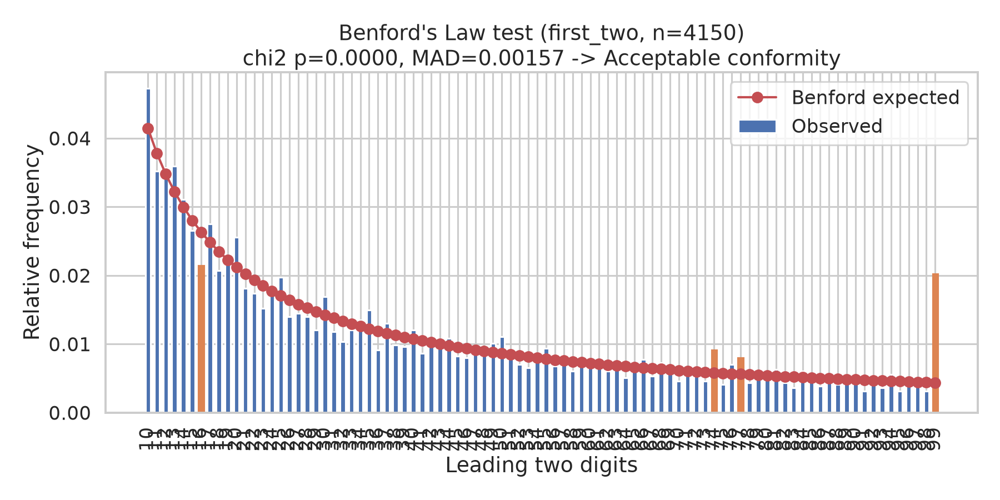
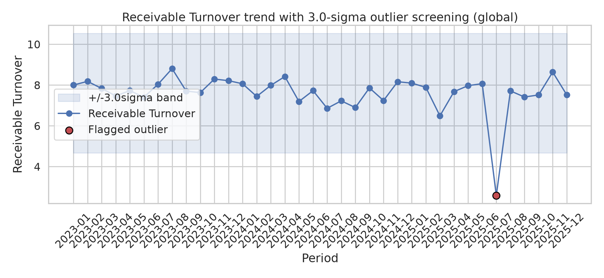

# 감사 증빙 및 재무 이상치 탐지(Anomaly Detection) 모델

회계감사에서 방대한 거래처 데이터·분개장(journal entries)을 전수 검토하기 어려울 때,
데이터 분석을 활용해 **위험이 높은 거래를 스크리닝**하는 절차를 코드로 구현한 프로젝트입니다.
감사기준서(ISA 240/315, ISA 520)가 요구하는 부정위험 평가·분석적 절차를
Python(Pandas, SciPy, Seaborn)으로 실제 동작하는 형태로 구현했습니다.

## 구현 내용

### 1. 벤포드의 법칙(Benford's Law) — 분개장 수치 위·변조 탐지
- `src/audit_anomaly/benford.py`
- 매출·매입 원장의 거래 금액에서 **선행 1자리 / 선행 2자리** 숫자 분포를 계산하고,
  벤포드 법칙이 예측하는 이론적 분포(`log10(1 + 1/d)`)와 비교합니다.
- **카이제곱 적합도 검정**(`scipy.stats.chisquare`)으로 전체 분포의 이탈 여부를 통계적으로 검정합니다.
- **Nigrini의 MAD(Mean Absolute Deviation) 기준**으로 적합성 등급(Close/Acceptable/Marginal/Nonconformity)을 자동 판정합니다.
- 자릿수별 **z-검정**을 통해 어느 특정 숫자(예: 반올림 금액, 승인한도 직전 금액)가 통계적으로
  유의하게 과다/과소 출현하는지 짚어내, 실무 감사인이 표본추출·정밀실증절차를 어디에 집중할지
  판단할 수 있는 근거를 제공합니다.

### 2. 3-시그마 통계적 이상치 탐지 — 재무비율 추세 스크리닝
- `src/audit_anomaly/outliers.py`
- 매출채권회전율, 유동비율, 매출총이익률 등 핵심 재무비율의 월별 시계열에서
  평균 ± 3표준편차(`sigma` 파라미터로 조정 가능) 범위를 벗어나는 구간을 자동으로 탐지합니다.
- 전체 기간 기준(`global`)과 이동평균 기준(`rolling`) 두 가지 베이스라인을 지원하여,
  추세가 있는 계정과 안정적인 계정 모두에 적용할 수 있습니다.
- Seaborn 기반 관리도(control chart) 스타일로 시각화하여, 어느 시점의 어떤 비율이
  비정상적으로 이동했는지(예: 매출채권 회전 급감 → 가공매출/채권 회수 지연 가능성) 한눈에 확인할 수 있습니다.

### 3. 샘플 데이터
실제 회사 데이터가 아닌, 재현 가능한 합성 데이터를 사용합니다(`src/audit_anomaly/data_gen.py`).
- 분개장: 정상 거래는 로그정규분포(자연스럽게 벤포드 법칙을 따름)로 생성하고,
  일부(약 3.5%)는 **반올림 금액**과 **승인한도 직전 금액**(예: 9,999,000원)으로 구성해
  실제 조작·분식 패턴을 흉내냅니다.
- 재무비율: 36개월 시계열에 3개의 이상치를 의도적으로 삽입합니다.

## 어필 포인트
- 감사기준서상 **위험평가 절차(Risk Assessment Procedures)**와 **분석적 절차(Analytical Procedures)**를
  추상적인 개념이 아니라 통계적으로 재현 가능한 코드로 구현했습니다.
- 단순 임계값 비교가 아니라 **카이제곱 검정·MAD·z-검정** 등 실제 포렌식 회계(Nigrini)에서
  쓰이는 통계 기법을 적용해, "왜 위험하다고 판단했는지"를 정량적으로 설명할 수 있습니다.
- 전체 지표는 정상 범위여도 **특정 자릿수만 유의하게 이탈**하는 사례(아래 실행 결과 참고)를 통해,
  총계 수준 분석만으로는 놓치는 세부 위험을 짚어내는 실무적 감각을 보여줍니다.

## 실행 방법

```bash
pip install -r requirements.txt
python -m audit_anomaly.cli
```

실행하면 `data/`에 샘플 분개장/재무비율 CSV가 생성되고, `output/`에 아래 차트가 저장됩니다.

- `benford_first_digit.png`, `benford_first_two_digits.png`
- `outliers_receivable_turnover.png`, `outliers_current_ratio.png`, `outliers_gross_margin.png`

### 실행 결과 예시

```
Benford's Law test: first digit(s), n=4150
Chi-square = 14.019 (p = 0.0813)
MAD = 0.00338  -> Close conformity
Digits flagged by |z| > 1.96: [9]

Benford's Law test: first_two digit(s), n=4150
Chi-square = 333.287 (p = 0.0000)
MAD = 0.00157  -> Acceptable conformity
Digits flagged by |z| > 1.96: [16, 74, 77, 99]
```

전체 카이제곱 검정과 MAD만 보면 "선행 1자리" 기준으로는 합격점(Close conformity)에 가깝지만,
**선행 2자리 검정에서는 99(=9,999,xxx원 형태의 승인한도 직전 금액)가 유의하게 과다 출현**함을
포착합니다. 이는 총계 수준의 스크리닝이 놓칠 수 있는 세부 조작 패턴을,
더 정교한 검정으로 짚어낼 수 있음을 보여주는 결과입니다.



재무비율 이상치 탐지 결과도 3개월치 데이터 조작(가공매출 등)을 가정한 급격한
매출채권회전율 하락 구간을 정확히 3-시그마 밖 이상치로 표시합니다.



## 테스트

```bash
pytest tests/ -v
```

정상 데이터에서는 오탐(false positive)이 없는지, 조작된 데이터에서는 실제로 탐지되는지를
검증하는 단위 테스트를 포함합니다.

## 프로젝트 구조

```
src/audit_anomaly/
  benford.py      # 벤포드 법칙 검정 (카이제곱, MAD, 자릿수별 z-검정)
  outliers.py      # 3-시그마 이상치 탐지 (global / rolling)
  visualize.py     # Seaborn 기반 시각화
  data_gen.py      # 재현 가능한 합성 감사 데이터 생성
  cli.py           # 전체 파이프라인 실행 스크립트
data/              # 생성된 샘플 CSV
output/            # 생성된 차트(PNG)
tests/             # pytest 단위 테스트
```

## 참고 문헌
- Nigrini, M. J. (2012). *Benford's Law: Applications for Forensic Accounting, Auditing, and Fraud Detection.* Wiley.
- IAASB, ISA 240 *The Auditor's Responsibilities Relating to Fraud in an Audit of Financial Statements.*
- IAASB, ISA 315 (Revised) *Identifying and Assessing the Risks of Material Misstatement.*
- IAASB, ISA 520 *Analytical Procedures.*
